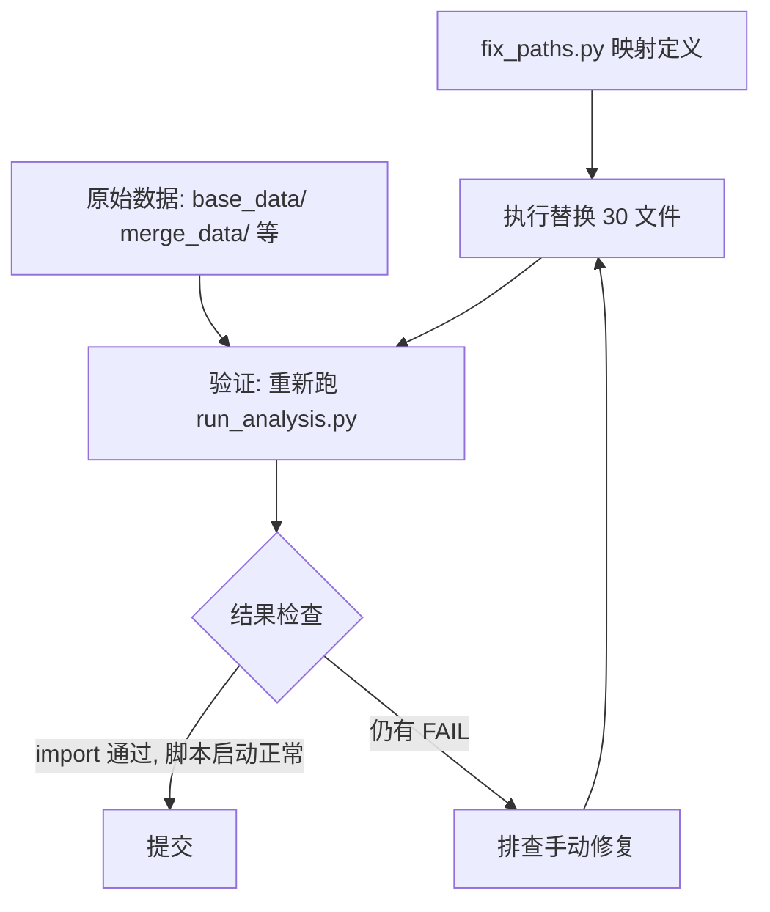

# 修复计划：硬编码 Windows 路径 → 跨平台相对路径

## 1. 背景

体检报告和运行分析报告均指出：31 个 `.py` 文件中包含硬编码的 Windows 绝对路径（`F:/...` 或 `E:/...`），导致在 macOS 上运行时必然 `FileNotFoundError`。这些脚本集中在 `sleep_stage/` 的 3 个子项目中。

### 决策记录（/before-dev 讨论确认）

| 议题 | 选项 | 决策 |
|------|------|------|
| 路径风格 | pathlib.Path / 字符串拼接 | **`pathlib.Path(__file__).parent`** |
| 修复范围 | 仅路径 / 路径+bug | **仅路径**（8 个 runtime bug 不动） |
| 缺失数据路径 | 保持硬编码 / 也转相对路径 | **也转相对路径**（格式统一，等数据到位自动生效） |
| 验证方式 | 跑 runner / 手动抽查 | **重新跑 `tools/run_analysis.py`** |
| feature_deal.py | 跳过 / 处理 | **跳过**（全注释文档伪装 .py） |

## 2. 范围

### 修复：30 个文件，53 处路径

#### Group A: IMU/data_deal_code/ (4 文件)

| 文件 | 路径数 | 数据存在 |
|------|--------|---------|
| `train_data_deal.py` | 2 | ✅ |
| `cal_label_count.py` | 2 | ✅ |
| `smote_label.py` | 2 | ✅（缺 imblearn 包，但路径本身存在） |
| `data_deal.py` | 2 | ✅（raw strings `r"F:\..."`） |

数据目录：`../base_data/`（相对于 `data_deal_code/`）

#### Group B: IMU/model/ (7 文件)

| 文件 | 路径数 | 数据存在 |
|------|--------|---------|
| `imu_cnn.py` | 1 | ✅ |
| `imu_cnn_lstm.py` | 1 | ✅ |
| `imu_cnn_rnn.py` | 1 | ✅ |
| `imu_kdtree.py` | 1 | ✅ |
| `imu_lstm.py` | 1 | ✅ |
| `imu_lstm_rnn.py` | 1 | ✅ |
| `imu_rnn.py` | 1 | ✅ |

数据目录：`../base_data/`（相对于 `model/`）
注意：硬编码路径有 `F:/ysl/...` 和 `E:/ysl/...` 两种，但均指向同一 `base_data/train_label.csv`。

#### Group C: Sleep-pdf/model/ (8 文件)

| 文件 | 路径数 | 数据存在 |
|------|--------|---------|
| `basic_rnn.py` | 1 | ✅ |
| `decsion_tree.py` | 1 | ✅ |
| `hybird_matrix.py` | 1 | ✅ |
| `psg_cnn.py` | 1 | ✅ |
| `psg_kdtree.py` | 1 | ✅（不同 CSV 文件） |
| `psg_knn.py` | 1 | ✅ |
| `psg_lstm.py` | 1 | ✅ |
| `psg_rnn_lstm.py` | 1 | ✅ |

数据目录：`../../merge_data/`（相对于 `model-模型训练代码/`）

#### Group D: Sleep-pdf/data_deal/ (4 文件)

| 文件 | 路径数 | 数据存在 |
|------|--------|---------|
| `balance_data-提取后数据的预处理.py` | 2 | ✅（merge_data） |
| `new_feature_deal-EEG提取.py` | 2 | ❌（sleep-cassette）+ ✅（merge_data） |
| `raw_data_extract.py` | 1 | ❌（ecg_chy1.xls） |
| `test.py` | 4 | ❌（sleep-cassette EDF） |

缺失数据路径仍转为相对路径，指向正确位置（即使数据不存在）。

#### Group E: 迁移标签/code/ (6 文件)

| 文件 | 路径数 | 数据存在 |
|------|--------|---------|
| `eeg_data_add_label_3.py` | 2 | ✅（time_frequent_signal） |
| `eeg_data_deal_1.py` | 2 | ✅（rawdata, EEG_data） |
| `eeg_data_to_base_2.py` | 2 | ✅（EEG_data, time_frequent_signal） |
| `imu_data_deal_1.py` | 2 | ✅（rawdata, EEG_data） |
| `add_imu_label_4.py` | 3 | ✅（time_frequent_signal, EEG_data） |
| `integrate_deal_process-只看这个代码.py` | 7 | ✅（model, EEG, PSG, IMU） |

数据目录：`../../{model,EEG_data,PSG_deal_data,IMU_deal_data,rawdata,time_frequent_signal}/`（相对于 `code-数据处理的代码(最终给IMU打上标签)/` 即迁移标签根目录）

#### Group F: 迁移标签/model/ (1 文件)

| 文件 | 路径数 | 数据存在 |
|------|--------|---------|
| `psg_rnn_lstm.py` | 1 | ✅ |

数据目录：`../../../Sleep-pdf处理代码/new_project/merge_data/`（跨项目引用）

### 跳过：1 个文件

| 文件 | 原因 |
|------|------|
| `feature_deal.py` | 全注释，文档伪装 .py |

## 3. 实施方法

### 核心原则

每处 `"F:/some/path/file.csv"` 替换为：
```python
str(Path(__file__).parent.parent / "subdir" / "file.csv")
```

- 使用 `str(...)` 包裹以确保字符串兼容性（部分 API 不接受 Path 对象）
- 在文件头部添加 `from pathlib import Path`（如尚未引入）
- 同一文件的多个路径共享同一个 BASE 变量以保持 DRY

### 工具

`tools/fix_paths.py` — 自动执行所有替换。包含：
- 完整的 30 文件 × 53 路径映射
- `from pathlib import Path` 自动添加
- 跳过 feature_deal.py
- 幂等性：第二次运行不会重复修改

### 不处理

- **8 个 runtime bug**（kdtree_data 的 Y= 未定义、lstm_classify 的 torch.tensor(Series) 等）— 与路径无关，单独跟踪
- **`imblearn` 缺失** — `smote_label.py` 独有，路径改好后仍需 `pip install imblearn`
- **sleep_classify/** 下的脚本 — 已使用相对路径，不涉及

## 4. 依赖关系



## 5. 验证

1. **工具 LSP 检查**: 修改后的文件无语法错误
2. **重新执行运行分析**:
   ```bash
   rm -f docs/superpowers/reports/run_results.json
   master_study_env/bin/python tools/run_analysis.py .
   ```
3. **验收标准**:
   - 30 个被修改文件 import 全部通过（不应再有 F:/ 路径导致的 FileNotFoundError）
   - 原 clean 的 18 个 sleep_classify 脚本不受影响
   - `feature_deal.py`（all-commented）不受影响

## 6. 回滚方案

如需撤销所有路径修改：
```bash
git checkout -- graduation_transfer/sleep_stage/
```

## 7. 后续任务（不在本次范围）

- 安装 `imblearn`（`smote_label.py` 需要）
- 修复 8 个 runtime bug
- 确认 sleep-cassette EDF 数据来源（本地生成或从远程服务器同步）
